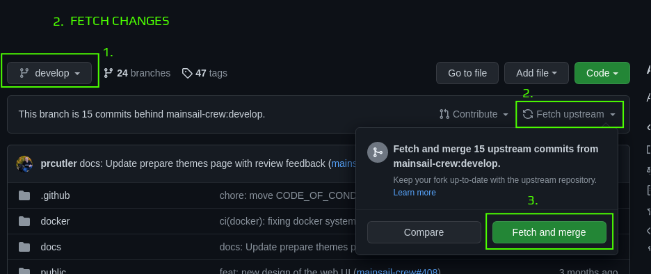
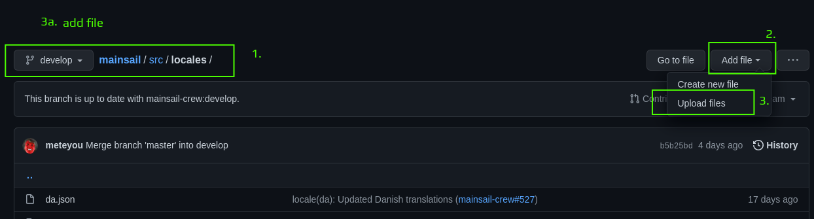
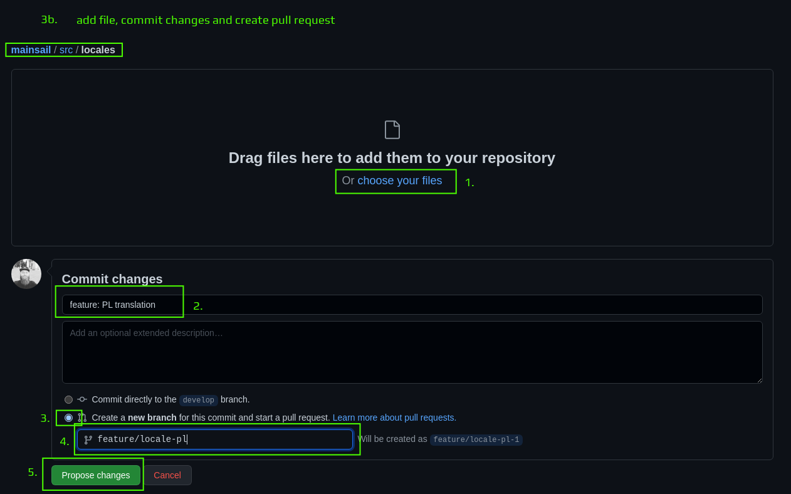
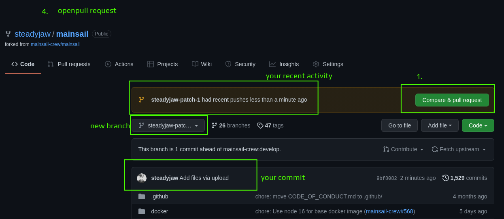
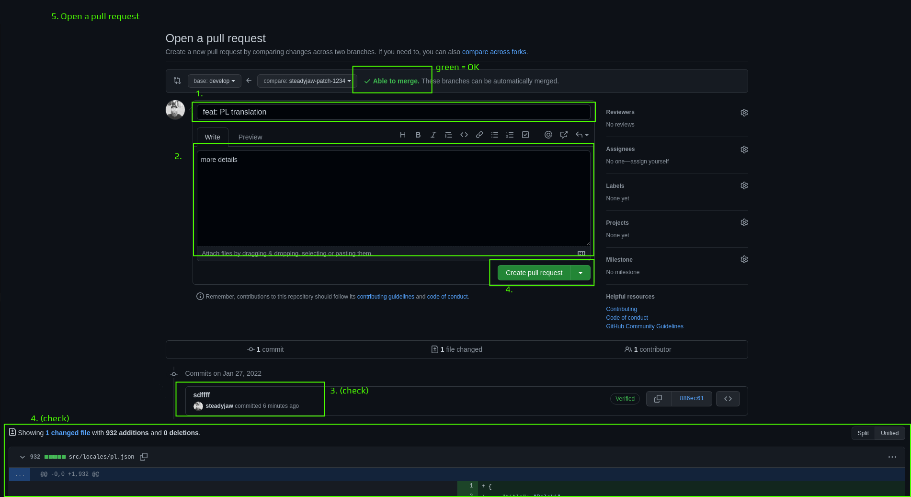

1. fork repository (you) - DONE
---

**From here you have to work in your forked repository:**
` https://github.com/your-username/mainsail`
---

3. fetch changes (you)
   1. Choose Branch: "develop"
   2. Click: "Fetch upstream"
   3. Click: "Fetch and Merge"

      
---
   
4. add file, commit changes and create pull request (you)

   1. Navigate to: /src/locales/
   2. Click: "Add file"
   3. Click: "Upload files"

    
---
   1. Add file: *drag into homepage* or *choose from browser* 
   2. Enter: *Commit Message* and *Commit optional details*
   3. **Choose: "Create a new branch for this commit and start a pull request."**
   4. Enter: *Branch name*
   5. Click: "Propose changes"
   
      

      > Attention: This action may show an error!
   
      > with error: continue with number 4.
      > 
      > no error: continue with number 5.
---
   
5. open pull request, fallback (you)
   1. go to your repository mainpage 
   2. Click: "Compare & pull request"

   
---

6. Open a pull request (you)
   1. Enter: PR title
   2. Enter: detailed information
   3. Scroll down: Make sure your commit is listed
   4. Scroll down: Make sure your changes are shown
   5. Click: "Create pull request"

   
---

7. review and feedback (we)
---

8. (optional) add and commit more changes (you)
---
9. (optional) review (you)
---
10. merge (we)
---
